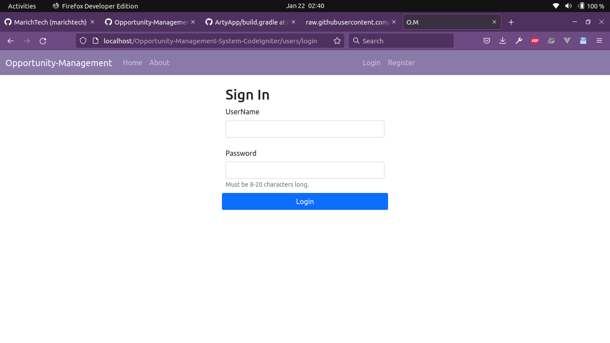
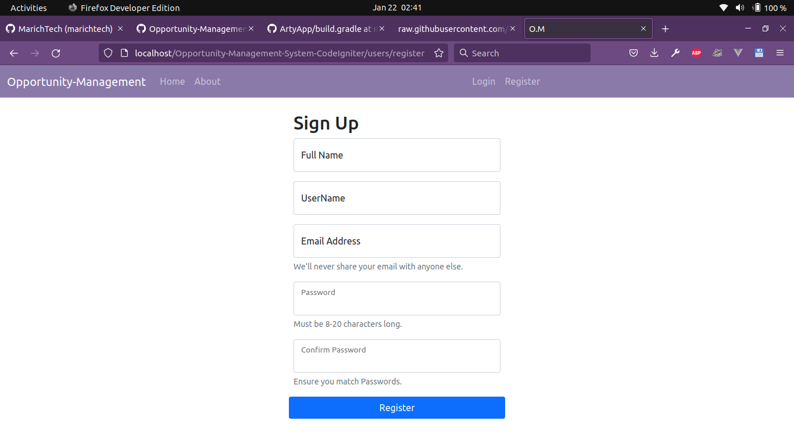
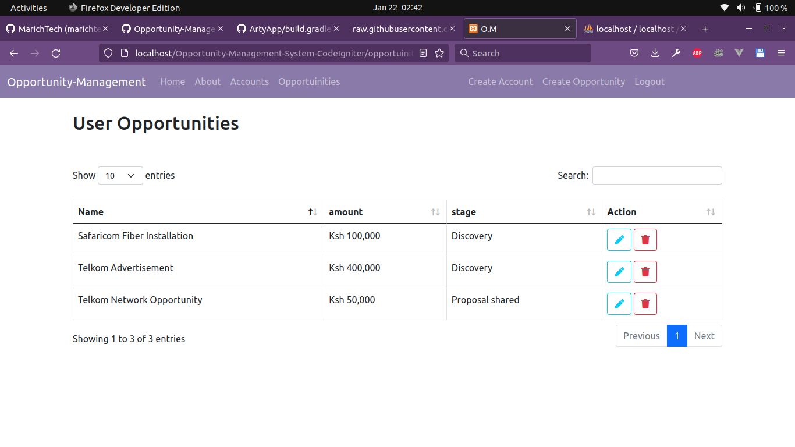
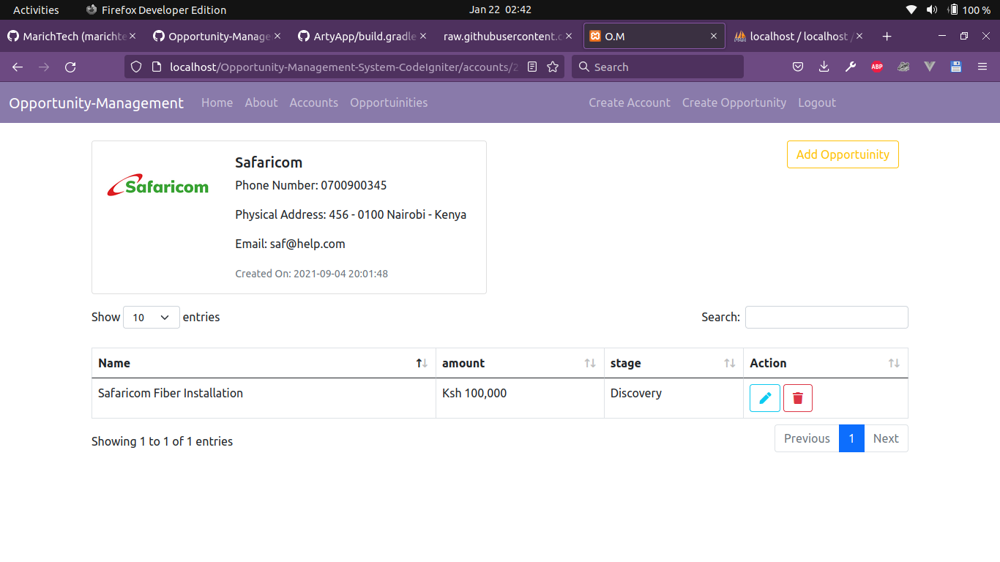
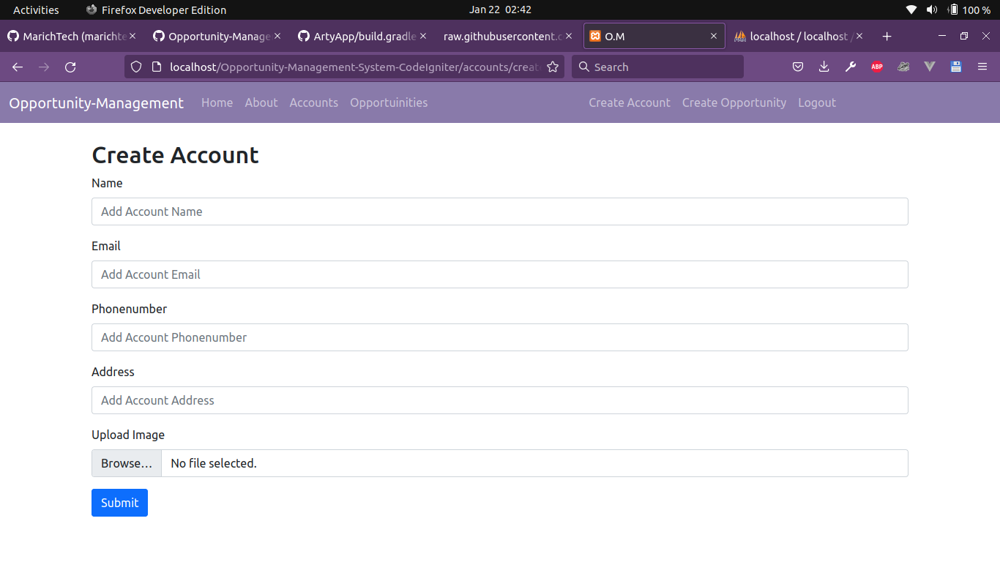

# Opportunity-Management-System-CodeIgniter
 An Opportunity Management system created using CoeIgniter 3
# Setup Steps

## Step 1 (Cloning the repository)
* Clone the repository and copy it to htdocs folder if you are using xammp server or into www folder if you are using wammp server

## Step 2 (Importing the database schema)
* In the root folder of this repository you will find a database schema named db.sql import it to your mysql server and you are set to go

### Web Preview
   
   

### Have fun

